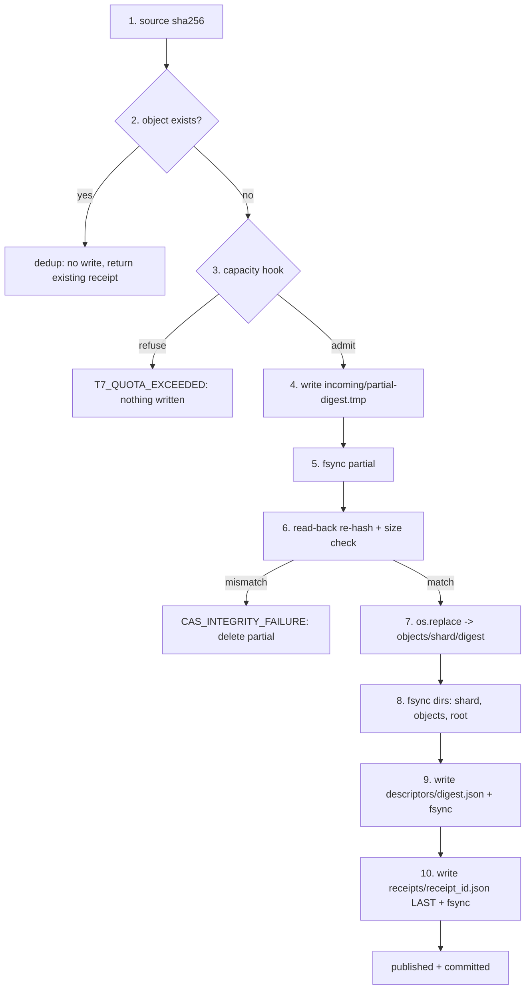

# CAS transaction engine (WP-C21)

This document is the architecture reference for the SRL CAS transaction engine
(`srl.cas.engine`), its canonical records (`srl.cas.descriptors`), and the full
integrity sweep (`srl.cas.fsck`). The machine-checkable contracts live in
`src/srl/cas/`; this document is the prose that explains *why* the transaction is
shaped the way it is.

WP-C20 (`docs/architecture/storage.md`) defined the storage abstraction, the T7
volume identity guard, and the simple `put` path. WP-C21 layers a
**crash-safe transaction** on top of that store: an ingest that either fully
publishes a content-addressed object with a durable descriptor and receipt, or
publishes nothing visible. A crash at any point leaves the store in either the
old valid state or the new valid state — never a half-published object.

Everything here is an *admission* and *integrity* contract. A green ingest means
the bytes were content-addressed, read-back verified, and durably published with
a commit-marker receipt; it never means a scientific claim is supported (see
`GOVERNANCE.md` for the evidence rules).

## Transaction order

`LocalArtifactStore.ingest_bytes` (delegating to `srl.cas.engine.ingest`)
performs a single ingest as a strict-order transaction. Each step has a
durability boundary (`fsync`) so a crash at any point produces one of the two
valid states.



The steps, with what each guarantees:

1. **Source hash.** `sha256(source_bytes)` is computed internally. The content
   address is never caller-supplied; the descriptor's `digest` is a pure function
   of the bytes the store received.
2. **Dedup check.** If `objects/<shard>/<digest>` already exists, the ingest
   returns the existing descriptor reference with `deduplicated=True` and writes
   **nothing**. A re-ingest of identical content is a no-op publish.
3. **Capacity policy.** The optional capacity hook is consulted *before* any byte
   is written. If it raises `QuotaExceededError` (`T7_QUOTA_EXCEEDED`), the
   ingest is refused and nothing is written.
4. **Write the partial.** The bytes are written to
   `incoming/partial-<digest>.tmp` (via a same-dir temp + rename so the partial
   name is canonical).
5. **fsync the partial.** Flush + `fsync` so the partial's contents are durable
   before the publish.
6. **Read-back re-hash.** The partial is read back, re-hashed, and compared to
   the source hash; the byte size is confirmed too. A mismatch raises
   `CasIntegrityError` (`CAS_INTEGRITY_FAILURE`, hard stop) and deletes the
   partial so the store is not left in a known-corrupt state.
7. **Exclusive publish.** `os.replace` atomically renames the partial into
   `objects/<shard>/<digest>`. On POSIX a reader sees the old state or the new
   state, never a half-written object. If the final path appeared between the
   dedup check and the publish (a concurrent ingest won), the partial is deleted
   and the ingest is treated as a dedup — the engine never overwrites a
   published object.
8. **fsync the directories.** The shard dir, `objects/`, and the root are
   `fsync`ed so the new directory entry is durable. (Directory fsync is
   best-effort: a filesystem that refuses it still got the atomic rename.)
9. **Write the descriptor.** `descriptors/<digest>.json` (the
   `ObjectDescriptor/v1`) is written atomically + `fsync`ed.
10. **Write the receipt.** `receipts/<receipt_id>.json` (the `IngestReceipt/v1`)
    is written **last** + `fsync`ed. The receipt is the commit marker: its
    presence is the proof the ingest completed.

## Receipt-last invariant

The defining property of the transaction is that the **receipt is the last
artifact written**. Everything before the receipt — the object bytes, the
descriptor — is recoverable; the receipt is the single record whose presence
means "this ingest committed."

A reader that finds a published object without a matching receipt knows the
ingest was interrupted between step 7 (publish) and step 10 (receipt). Such an
object is *visible* but *uncommitted*: `fsck_full` reports it as a candidate for
reconciliation (missing descriptor, or descriptor referencing an absent receipt).
The autonomy layer may re-ingest the same bytes (which dedups to the existing
object and completes the receipt) or treat the object as an orphan.

The receipt's `receipt_id` is the content-addressed identity of the receipt
record (the SHA-256 of the canonical encoding of the receipt *without* its own
`receipt_id` field — see `srl.contracts.ids` for the no-self-hash pattern). The
descriptor's `ingest_receipt_id` references this id, so the descriptor is only
*meaningful* once the receipt exists.

## Canonical records

Two canonical JSON records are produced per ingest (`srl.cas.descriptors`):

**`ObjectDescriptor/v1`** — describes a published object:

```json
{
  "schema_version": "ObjectDescriptor/v1",
  "digest": "sha256:<64 hex>",
  "size_bytes": 42,
  "media_type": "application/octet-stream",
  "created_utc": "2026-07-28T12:00:00Z",
  "ingest_receipt_id": "sha256:<64 hex>"
}
```

Written to `descriptors/<digest>.json` at step 9.

**`IngestReceipt/v1`** — the commit marker, written last:

```json
{
  "schema_version": "IngestReceipt/v1",
  "receipt_id": "sha256:<64 hex>",
  "digest": "sha256:<64 hex>",
  "size_bytes": 42,
  "source_hash_verified": true,
  "readback_hash_verified": true,
  "fsynced": true,
  "created_utc": "2026-07-28T12:00:00Z"
}
```

Written to `receipts/<receipt_id>.json` at step 10. The three boolean flags
record the integrity invariants the engine enforced (`source_hash_verified` is
always true for an engine ingest; `readback_hash_verified` records that the
published bytes were read back and re-hashed; `fsynced` records that the file and
directories were fsynced).

Both records validate against strict key sets and the shared digest / byte-count
/ timestamp / media-type policies (see `srl.contracts`).

## Crash matrix

A crash at any step leaves the store in either the old valid state (no object,
no descriptor, no receipt) or the new valid state minus the receipt (object
published, receipt absent — recoverable). The table shows the state after a
crash at each boundary:

| Crash point                 | Object | Descriptor | Receipt | Recovery                         |
|-----------------------------|--------|------------|---------|----------------------------------|
| Before step 4 (write)       | absent | absent     | absent  | clean; nothing happened          |
| After step 4 (tmp write)    | absent | absent     | absent  | partial in `incoming/`; reported |
| After step 5 (fsync)        | absent | absent     | absent  | partial in `incoming/`; reported |
| After step 6 (read-back fail) | absent | absent   | absent  | partial deleted; `CAS_INTEGRITY_FAILURE` |
| After step 7 (publish)      | present | absent   | absent  | fsck: missing descriptor; re-ingest dedups + completes |
| After step 8 (dir fsync)    | present | absent   | absent  | fsck: missing descriptor         |
| After step 9 (descriptor)   | present | present  | absent  | fsck: bad receipt (absent)       |
| After step 10 (receipt)     | present | present  | present | committed (new valid state)      |

The invariant that holds at **every** boundary: a partial is never visible as an
object (the object path only exists after the atomic `os.replace`), and the
receipt is never written without the object and descriptor preceding it.

The gate (`scripts/checks/wp21-gate.py`, check C21-05) injects failures at four
of these boundaries and asserts the invariant. The unit tests
(`tests/cas/test_engine_crash.py`) cover the full matrix.

## fsck (full integrity sweep)

`LocalArtifactStore.fsck_full` (delegating to `srl.cas.fsck.run_fsck`) walks the
whole store and detects five classes of trouble, returning a `CasFsckReport`
with one typed `FsckIssue` per problem:

| Issue kind           | Meaning                                                                 |
|----------------------|-------------------------------------------------------------------------|
| `hash_mismatch`      | An object's bytes do not hash back to its path digest (corruption).     |
| `missing_descriptor` | An object exists but has no descriptor record.                          |
| `orphan_descriptor`  | A descriptor exists but its object is absent.                           |
| `size_drift`         | An object's on-disk size disagrees with the descriptor's `size_bytes`.  |
| `bad_receipt`        | A receipt's `receipt_id` does not match its content, or a descriptor references an absent receipt. |
| `malformed_record`   | A descriptor/receipt file is not valid JSON or fails schema validation. |

The sweep is read-only: it never writes, deletes, or repairs. `report.ok` is
`True` iff there are zero issues (exit-code-friendly). The plain
`LocalArtifactStore.fsck` (WP-C20, per-object hash pass/fail only) is preserved
unchanged for backward compatibility.

## Dedup

Content addressing makes dedup natural: two ingests of identical bytes have the
same SHA-256, so they map to the same object path. The engine checks the object
path *before* writing (step 2) and again *after* the read-back (step 7, the
concurrent-win case). A dedup:

- writes **no** bytes (no object, no descriptor, no receipt);
- returns the existing descriptor reference, carrying forward the original
  `receipt_id`;
- is marked `deduplicated=True` on the `IngestOutcome`.

The gate (C21-01, C21-04) and tests pin this: two ingests produce one object,
and 1,000 deduplicating ingests produce exactly one object file with zero
overwrites.

## Path safety

The content address (the digest) is validated against `^[0-9a-f]{64}$` *before*
it is ever joined to a path (see `_require_safe_hex_digest` in
`srl.cas.engine`). This is defense-in-depth: the digest is computed internally
(a caller cannot supply it), but joining an unvalidated string to a path is a
traversal hazard, and the regex makes `../`-style digests impossible. The check
runs before any path construction, so a future code path that might let a caller
influence the digest still cannot escape the store root.

The object path layout is sharded (`objects/<dd>/<digest>` where `dd` is the
first two hex characters), mirroring WP-C20, so any one directory stays small.

## Capacity policy

The capacity hook (`CapacityHook`) is a callable `(used_bytes, size_bytes) ->
None` consulted at step 3, before any byte is written. It raises
`QuotaExceededError` (`T7_QUOTA_EXCEEDED`, a soft stop per the fail-reason
registry) to refuse the ingest. `default_capacity_hook(table_bytes)` builds a
hook that refuses when projected usage exceeds a ceiling. The engine does not
recompute usage — the caller owns the accounting and passes `used_bytes` to
`ingest_bytes`, which forwards it to the hook.

## Crash recovery

`recover_partials(root)` lists stale partial files in `<root>/incoming/`. A
partial is a file named `partial-<digest>.tmp` left over from an interrupted
ingest. The engine **never auto-deletes** partials: a partial is evidence of an
interrupted transaction, and deletion is an explicit operator choice. Each
partial is classified:

- `published=True` — the object for the partial's digest already exists; the
  publish completed but the partial cleanup was interrupted. Safe to delete.
- `published=False` — the object does not exist; the ingest was interrupted
  before the publish. May be resumed (re-ingesting the same bytes completes the
  publish) or deleted.

The autonomy layer is expected to call `recover_partials` at startup and decide
per-partial whether to resume or delete.

## Standard library only

The engine uses only the standard library plus the in-repo `srl.contracts`
package (for canonical encoding and the shared digest / byte-count / media-type /
timestamp validators). Importing `srl.contracts` pulls `jsonschema` (the
contracts-layer meta-validation dependency); this is acceptable because the CAS
engine is a **control-plane component**, and the canonical encoding is used only
for the small descriptor and receipt records. The hot byte-path hashes are
computed directly from the bytes (`hashlib.sha256`), never through canonical
JSON, so a large ingest stays cheap.
