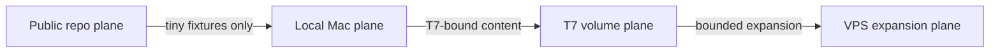
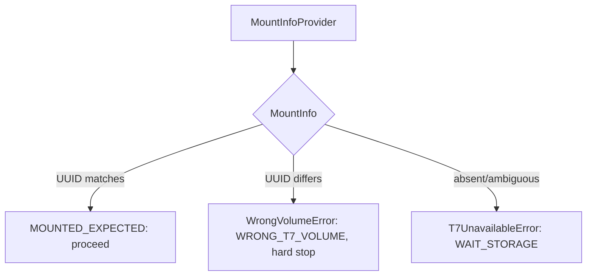

# Storage abstraction and T7 volume identity

This document is the architecture reference for the SRL content-addressed
storage plane (`srl.cas`): the abstract byte-store interface, the T7 volume
identity guard, the capacity allocation policy, the public-tiny-fixture
fallback, and the path-redaction privacy layer. The machine-checkable contracts
live in `src/srl/cas/`; this document is the prose that explains *why* they are
shaped the way they are.

Everything here is an *admission* and *routing* contract. A green return from a
store operation means the bytes were content-addressed and integrity-verified;
it never means a scientific claim is supported (see `GOVERNANCE.md` for the
evidence rules).

## The four storage planes

SRL content lives across four planes, each with a different trust profile and a
different lifecycle. The CAS layer's job is to route an object to the right
plane and refuse the wrong one.



| Plane        | Trust profile                              | WP-C20 role                          |
|--------------|--------------------------------------------|--------------------------------------|
| **Public**   | World-readable; committed to the repo.     | Conformance vectors, schemas, docs.  |
| **Mac**      | Operator's workstation; not public.        | Local fallback for tiny fixtures; the local store test backend. |
| **T7**       | Operator-owned external volume; identity-verified. | Authoritative home for T7-bound content (pack images, run receipts, datasets). |
| **VPS**      | Expansion target; out of scope for WP-C20. | Refused (`vps_expansion_allowed=false`). |

The boundary that matters most is **Mac → T7**: T7-bound content must never
fall back to the Mac plane, because a local copy is not the authoritative
record. The fallback exists *only* for public tiny fixtures that are not
T7-bound.

## Content addressing

Every object stored via `ArtifactStore.put` is keyed by the SHA-256 of its
bytes:

```
sha256:<64 lowercase hex>
```

The store never trusts a caller-supplied digest. The descriptor's `digest` is
computed from the bytes the store actually received, so the key is a pure
function of content. This mirrors the digest policy in
`srl.contracts.artifact_refs` and the object-identity model in
`srl.contracts.ids`: a descriptor's digest is interchangeable with an
`ArtifactRef` digest, and two independent agents that store the same bytes
compute the same key with no coordination.

`LocalArtifactStore` writes each object to a sharded path
(`<root>/objects/<dd>/<digest>`, where `dd` is the first two hex characters)
and verifies the digest on every read and on every `fsck`. A mismatch raises
`StoreIntegrityError` (`CAS_INTEGRITY_FAILURE`, hard stop) so a corrupted object
is never silently returned.

## T7 volume identity guard

The T7 volume is an external, operator-owned physical volume. Before the store
writes to it, the runtime must confirm that the volume mounted at the expected
mount point is *the* volume the mission expects (by its filesystem Volume UUID),
and not a different volume that happens to share the mount point.

The expected identity comes from a **local config file outside the repository**
(the path is passed in by the operator; it is never hardcoded). Keeping it
outside the repo means a clone never carries an operator's volume identity, and
the identity is never committed to the public history.



The actual volume probe is performed by an injectable *provider* — a callable
returning a `MountInfo` dict (`{volume_uuid, mount_point, fs_type}`). The
default provider shells out **only** to `diskutil info <mountpoint>` on macOS
and parses the `Volume UUID` field; it executes nothing else and writes
nothing. Tests inject a fake provider so they are hermetic and never touch a
real disk.

The guard fails closed on any parse ambiguity: a provider output that does not
contain exactly the three expected keys with the right shapes is treated as
unavailable (`T7_UNAVAILABLE`), never as "close enough".

### Failure routing

Two distinct failures, each typed:

| Failure              | `fail_reason`     | `hard_stop` | Store action                       |
|----------------------|-------------------|-------------|-----------------------------------|
| Wrong volume mounted | `WRONG_T7_VOLUME` | `true`      | Fail closed; no bytes written; no fallback. |
| T7 unavailable       | `T7_UNAVAILABLE`  | `false`     | Wait (`WAIT_STORAGE`); the volume may appear later. |

A wrong volume is a hard stop because a byte written to the wrong volume is
unverifiable. An absent volume is a wait, not a failure, because the volume may
appear later (the operator plugs it in).

## WAIT_STORAGE semantics

When the T7 is unavailable the store **waits**. The autonomy machinery treats
`WAIT_STORAGE` as a non-terminal, retryable condition: the mission is not
failed, and the store is re-consulted once the volume appears.

Crucially, `WAIT_STORAGE` never falls back to a local volume for T7-bound
content. The local store is **market-irrelevant** for T7-bound objects: a local
copy of a pack image, a run receipt, or a dataset is not the authoritative
record, and silently substituting one would defeat the content-addressing
guarantee. The wait is the honest answer ("the authoritative store is not
here yet"), not a degradation.

The only exception is public tiny fixtures (see below), which are not T7-bound
and may legitimately live in a local store.

## Capacity allocation

The T7 volume is a bounded, mission-scoped resource. The P0 allocation table
partitions the 50 GiB hard ceiling across object classes:

| Class          | Budget (GiB) | T7-bound |
|----------------|-------------|----------|
| packs          | 20          | yes      |
| source blobs   | 10          | yes      |
| fixtures       | 5           | **no**   |
| pilot runs     | 5           | yes      |
| catalog/sbom   | 5           | yes      |
| quarantine     | 5           | yes      |
| **Total**      | **50**      |          |

Run receipts fold into the packs slice (they are light metadata bound for the
same T7 region); datasets fold into the source-blobs slice. This keeps the six
named budgets summing to the hard ceiling while still answering the per-class
question.

`check_capacity(used_bytes)` classifies usage against three thresholds drawn
from the table:

| Band             | `used_bytes` range (default) | Decision          |
|------------------|------------------------------|-------------------|
| OK               | `[0, 35 GiB)`                | proceed           |
| WARNING          | `[35, 45) GiB`               | proceed + note    |
| REVIEW_REQUIRED  | `[45, 50) GiB`               | proceed + review  |
| EXCEEDED         | `>= 50 GiB`                  | refuse (`T7_QUOTA_EXCEEDED`) |

The bands are half-open so a value exactly on a threshold falls into the higher
band: reaching the ceiling is the refusal condition, not approaching it. An
`EXCEEDED` decision refuses the ingest at the store layer with
`T7_QUOTA_EXCEEDED` (`hard_stop=false`, `retriable=false`).

## Public-tiny-fixture fallback

The local fallback store (`LocalFallbackStore`) accepts **only** public tiny
fixtures — small, public, reproducible test vectors that are not T7-bound. It
enforces the policy with hard limits:

- **single-object max 1 MiB** — a fixture above this is refused with
  `WAIT_STORAGE` (it is not "tiny");
- **total max 25 MiB** — the fallback's aggregate usage is capped at a small
  fraction of the T7 ceiling so it cannot silently become a shadow store;
- **T7-bound object classes refused** — any object whose class is T7-bound
  (everything except `FIXTURE`) is refused with `WAIT_STORAGE` regardless of
  size;
- **root must be inside an explicitly passed directory** — the fallback never
  invents its own root (no home, no temp default).

The fallback is a thin policy layer over `LocalArtifactStore`: it validates the
ingest, then delegates the byte path. This keeps one writer (the local store)
and one policy (the fallback).

## Privacy: path redaction

A content-addressed store may be rooted at a host-local directory (a T7 mount
point, an operator home directory). Receipts and logs that name the store root
would leak the operator's machine layout (`/Volumes/...`, `/Users/...`), which
is a `PUBLIC_LEAK_DETECTED`-class leak.

`redact_store_path(path)` reduces any store path to a **digest-prefix form**:

```
redacted:<16 lowercase hex>
```

The prefix makes the token self-describing (a reader knows it is a redacted
path, not a real one). The 16-hex width is long enough to distinguish stores in
a single mission while being cryptographically unrecoverable.

Every public function in `srl.cas` that returns a path or a receipt string
routes through `redact_store_path`. The WP-C20 gate (`scripts/checks/wp20-gate.py`,
check C20-03) asserts no public-API string output ever begins with `/Volumes/`
or `/Users/`.

## The T7 store stub

`T7ArtifactStore` is a **stub**: its identity guard, capacity policy, and
mount-state probe are real (and exercised in tests and the gate), but the byte
path refuses every operation with `WAIT_STORAGE` until WP-C21 implements the
transaction engine.

The stub exists to make the contract explicit: the store is *known* and *named*,
its identity and capacity are *verified*, but it does not write. Callers
fail-fast toward the wait path rather than discovering a silent no-op. WP-C21
will implement the atomic cross-object writes (with a write-ahead log) that make
the byte path safe.

## Testing posture

The entire CAS layer is hermetic. Tests and CI inject fake providers and use
temporary directories for the local store; no test ever touches a real disk or
spawns `diskutil`. Every volume UUID in the fixtures is a fake (the canonical
RFC 4122 variant/version bits are set so the shape parses, but no value
corresponds to a real operator volume).

The WP-C20 gate runs four checks and emits a `GateReceipt/v1`:

- **C20-01** — wrong volume → fail closed (`WRONG_T7_VOLUME`, no bytes written,
  no fallback).
- **C20-02** — unplugged T7 → `WAIT_STORAGE`; the local store is
  market-irrelevant for T7-bound content.
- **C20-03** — the agent-facing API never emits a raw T7/home path.
- **C20-04** — fallback accepts a tiny public fixture and refuses a T7-class
  object.
